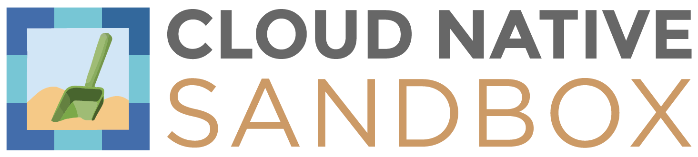

KubeDig is a cloud-native runtime security enforcement system that restricts the behavior \(such as process execution, file access, and networking operations\) of pods, containers, and nodes (VMs) at the system level.

KubeDig leverages [Linux security modules \(LSMs\)](https://en.wikipedia.org/wiki/Linux_Security_Modules) such as [AppArmor](https://en.wikipedia.org/wiki/AppArmor), [SELinux](https://en.wikipedia.org/wiki/Security-Enhanced_Linux), or [BPF-LSM](https://docs.kernel.org/bpf/prog_lsm.html) to enforce the user-specified policies. KubeDig generates rich alerts/telemetry events with container/pod/namespace identities by leveraging eBPF.

|  |   |
|:---|:---|
| :muscle: **[Harden Infrastructure](getting-started/hardening_guide.md)** 
:chains: Protect critical paths such as cert bundles  :clipboard: MITRE, STIGs, CIS based rules  :left_luggage: Restrict access to raw DB table | :ring: **[Least Permissive Access](getting-started/least_permissive_access.md)** 
:traffic_light: Process Whitelisting  :traffic_light: Network Whitelisting  :control_knobs: Control access to sensitive assets |
| :telescope: **[Application Behavior](getting-started/workload_visibility.md)** 
:dna: Process execs, File System accesses  :compass: Service binds, Ingress, Egress connections  :microscope: Sensitive system call profiling | :snowflake: **[Deployment Models](getting-started/deployment_models.md)** 
:wheel_of_dharma: Kubernetes Deployment :whale2: Containerized Deployment :computer: VM/Bare-Metal Deployment |

## Architecture Overview

## Documentation :notebook:

* :point_right: [Getting Started](getting-started/deployment_guide.md)
* :dart: [Use Cases](getting-started/use-cases/hardening.md)
* :heavy_check_mark: [KubeDig Support Matrix](getting-started/support_matrix.md)
* :chess_pawn: [How is KubeDig different?](getting-started/differentiation.md)
* :scroll: Security Policy for Pods/Containers [[Spec](getting-started/security_policy_specification.md)] [[Examples](getting-started/security_policy_examples.md)]
* :scroll: Cluster level security Policy for Pods/Containers [[Spec](getting-started/cluster_security_policy_specification.md)] [[Examples](getting-started/cluster_security_policy_examples.md)]
* :scroll: Security Policy for Hosts/Nodes [[Spec](getting-started/host_security_policy_specification.md)] [[Examples](getting-started/host_security_policy_examples.md)] 
... [detailed documentation](https://docs.kubedig.io/kubedig/)

### Contributors :busts_in_silhouette:

* :blue_book: [Contribution Guide](contribution/contribution_guide.md)
* :technologist: [Development Guide](contribution/development_guide.md), [Testing Guide](contribution/testing_guide.md)
* :raised_hand: [Join KubeDig Slack](https://cloud-native.slack.com/archives/C02R319HVL3)
* :question: [FAQs](getting-started/FAQ.md)

### Biweekly Meeting

- :speaking_head: [Zoom Link](http://zoom.kubedig.io)
- :page_facing_up: Minutes: [Document](https://docs.google.com/document/d/1IqIIG9Vz-PYpbUwrH0u99KYEM1mtnYe6BHrson4NqEs/edit)
- :calendar: Calendar invite: [Google Calendar](http://www.google.com/calendar/event?action=TEMPLATE&dates=20220210T150000Z%2F20220210T153000Z&text=KubeDig%20Community%20Call&location=&details=%3Ca%20href%3D%22https%3A%2F%2Fdocs.google.com%2Fdocument%2Fd%2F1IqIIG9Vz-PYpbUwrH0u99KYEM1mtnYe6BHrson4NqEs%2Fedit%22%3EMinutes%20of%20Meeting%3C%2Fa%3E%0A%0A%3Ca%20href%3D%22%20http%3A%2F%2Fzoom.kubedig.io%22%3EZoom%20Link%3C%2Fa%3E&recur=RRULE:FREQ=WEEKLY;INTERVAL=2;BYDAY=TH&ctz=Asia/Calcutta), [ICS file](getting-started/resources/KubeDigMeetup.ics)

## Notice/Credits :handshake:

- KubeDig uses [Tracee](https://github.com/aquasecurity/tracee/)'s system call utility functions.

## CNCF

KubeDig is [Sandbox Project](https://www.cncf.io/projects/kubedig/) of the Cloud Native Computing Foundation.

## ROADMAP

KubeDig roadmap is tracked via [KubeDig Projects](https://github.com/orgs/kubedig/projects?query=is%3Aopen)
