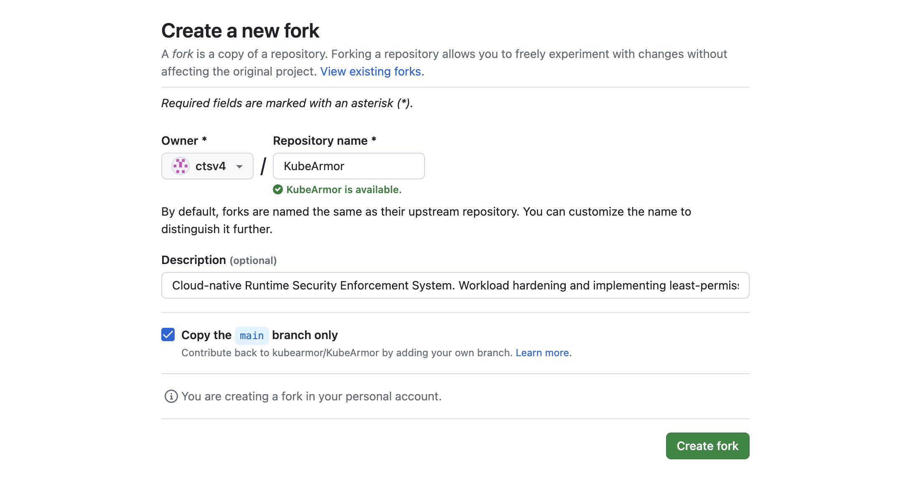

# Contribution Guide

KubeDig maintainers welcome individuals and organizations from across the cloud security landscape (creators and implementers alike) to make contributions to the project. We equally value the addition of technical contributions and enhancements of documentation that helps us grow the community and strengthen the value of KubeDig. We invite members of the community to contribute to the project!

To make a contribution, please follow the steps below.


1. Fork this repository \(KubeDig\)

   First, fork this repository by clicking on the Fork button \(top right\).

     

   Then, click your ID on the pop-up screen.

     

   This will create a copy of KubeDig in your account.

     

2. Clone the repository

   Now clone Kubedig locally into your dev environment.

   ```text
    $ git clone https://github.com/[your GitHub ID]/KubeDig
   ```

   This will clone a copy of Kubedig installed in your dev environment.

3. Make changes

   First, go into the repository directory and make some changes.

   Please refer to [development guide](development_guide.md) to set up your environment for KubeDig contribution.  

4. Check the changes

   Please run "test_kubedig.sh" before committing the changes

   ```text
   cd KubeDig/KubeDig/build
   ~/KubeDig/KubeDig/build$ ./test_kubedig.sh
   ```

   If you see any warnings or errors, please fix them first.

5. Commit changes

   Please see your changes using "git status" and add them to the branch using "git add".

   ```text
    $ cd KubeDig
    ~/KubeDig$ git status
    ~/KubeDig$ git add [changed file]
   ```

   Then, commit the changes using the "git commit" command.

   ```text
    ~/KubeDig$ git commit -s -m "Add a new feature by [your name]"
   ```

   Please make sure that your changes are properly tested on your machine.  

6. Push changes to your forked repository

   Push your changes using the "git push" command.

   ```text
    ~/KubeDig$ git push
   ```

7. Create a pull request with your changes with the following steps

   First, go to your repository on GitHub.

     

   Then, click "Pull request" button.

     

   After checking your changes, click 'Create pull request'.

     

   A pull request should contain the details of all commits as specific as possible, including "Fixes: \#\(issue number\)".  

   Finally, click the "Create pull request" button.

   The changes would be merged post a review by the respective module owners. Once the changes are merged, you will get a notification, and the corresponding issue will be closed.

8. DCO Signoffs

   To ensure that contributors are only submitting work that they have rights to, we are requiring everyone to acknowledge this by signing their work. Any copyright notices in this repo should specify the authors as "KubeDig authors".

   To sign your work, just add a line like this at the end of your commit message:

   ```
   Signed-off-by: FirstName LastName <email@address.com>
   ```

   This can easily be done with the `-s` or `--signoff` option to `git commit`.

   By doing this, you state that the source code being submitted originated from you (see https://developercertificate.org).
