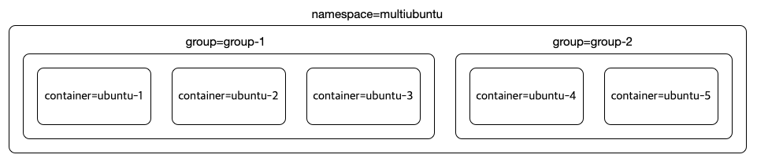

# Multiubuntu



1. Deployment

    To deploy the multiubuntu microservice, please run the following commands.

    ```text
    $ cd KubeDig/examples/multiubuntu
    ~/KubeDig/examples/multiubuntu$ kubectl apply -f .
    ```

2. Use Cases

    To verify KubeDig's functionalities, we provide sample security policies for the multiubuntu microservice.

    * Example 1 - Block a process execution

        * Deploy a security policy

            ```text
            $ cd KubeDig/examples/multiubuntu/security-policies
            .../multiubuntu/security-policies$ kubectl -n multiubuntu apply -f ksp-group-1-proc-path-block.yaml
            ```

        * Execute /bin/sleep inside of the ubuntu-1 pod

            ```text
            $ POD_NAME=$(kubectl get pods -n multiubuntu -l "group=group-1,container=ubuntu-1" -o jsonpath='{.items[0].metadata.name}') && kubectl -n multiubuntu exec -it $POD_NAME -- bash
            # sleep 1
            (Permission Denied)
            ```

        * Check audit logs

            ```text
            $ karmor log --json

            Run the above command in other terminal to see logs live.
            To install karmor cli tool [refer](https://github.com/zfz-725/kubedig-client).
            ```

    * Example 2 - Block a file access

        * Deploy a security policy

            ```text
            $ cd security-policies
            .../multiubuntu/security-policies$ kubectl -n multiubuntu apply -f ksp-ubuntu-5-file-dir-recursive-block.yaml
            ```

        * Access /credentials/password inside of the ubuntu-5 pod

            ```text
            $ POD_NAME=$(kubectl get pods -n multiubuntu -l "group=group-2,container=ubuntu-5" -o jsonpath='{.items[0].metadata.name}') && kubectl -n multiubuntu exec -it $POD_NAME -- bash
            # cat /credentials/password
            (Permission Denied)
            ```

        * Check audit logs

            ```text
            $ karmor log --json
            ```
