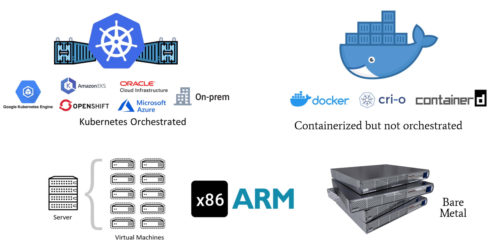

# Supported Deployment Models

KubeDig supports following deployment models:
1. Kubernetes orchestrated deployment with KubeDig deployed as a **daemonset**.
2. Containerized deployment with KubeDig deployed in **systemd mode** on the VM/EC2/Bare-Metal instance.
3. Non-containerized applications with KubeDig deployed in **systemd mode**.

