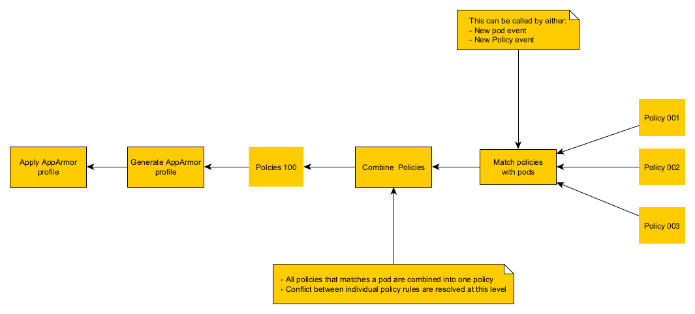
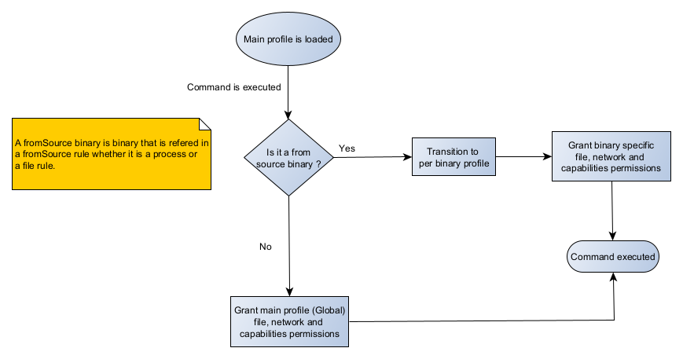

# KubeDig AppArmor implementation overview

Kubedig support enforcing policies on systems running apparmor.

## Implementation overview

Upon the detection of a new Pod or a new policy, KubeDig will launch a policy matching process that works as follow:

- If a new pod is detected, KubeDig will only search for policies that matches that perticular pod.
- If a new policy is detected, KubeDig will search for all pods that the policy include.

When all policies are identified, KubeDig combines all policies into a single policy. If two policies are conflicting KubeDig will resolve this conflict.

Once we have a single policy, KubeDig will generate and load the corresponding AppArmor profile(s).

## AppArmor profile domain transition

KubeDig makes a heavy use of apparmor domain transition in order to honor `fromSource` rules.

The domain transion is made possible using the `px` permission in apparmor.

The above figure illustrate how we decide that we need to perform a domain transition for a certain binary.

## Apparmor profiles for privileged pods and pods with additional capabilities 

Pods with additional capabilities are supported across all runtimes, hence apparmor profiles can be set here. We provide more capabilities than docker default profile to make them work.

On **containerd** runtime, we are able to use apparmor profiles to secure privileged pods. 
However on **cri-o** and **docker** runtimes, they do not allow us to set any apparmor profile for privileged pods.

